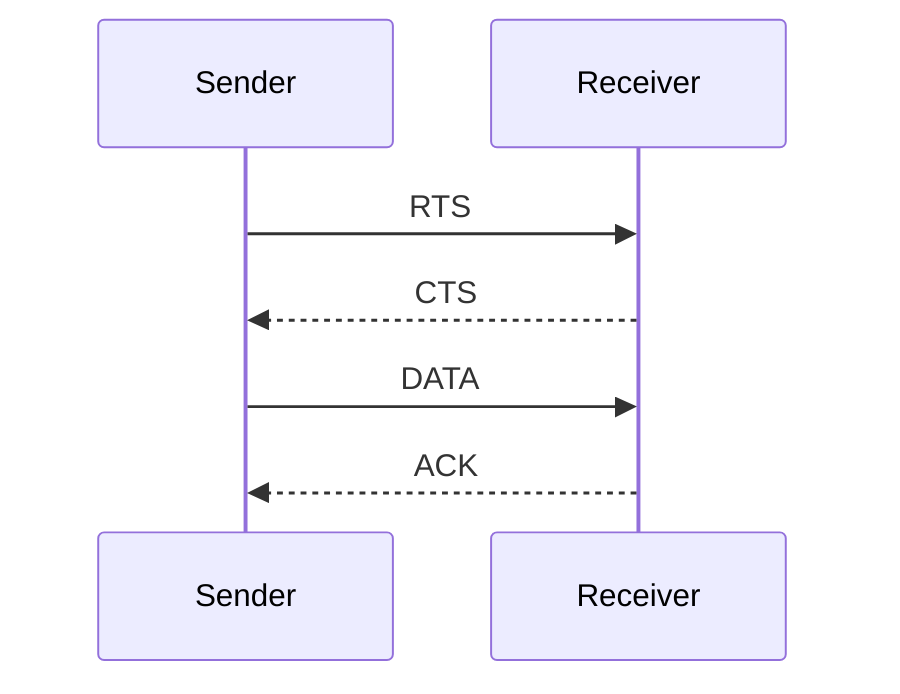

#### WI-FI
> MAC service set, Mac Data Frame , CSMA/CA 동작 방식
##### WI-FI Service Set
1) BSS(Basic Service Set)
    - AP가 없으면 ad hoc 모드
    - AP가 있으면 infrastructure모드
2) ESS 
    - 두 개 이상의 BSS들이 모여서 구성

##### MAC 방식
1) PCE(Point coordination function)
    - Option
    - 중앙 집붕식 Polling 방식 사용
2) DCF(Distributed Coordination function)
    - CSMA.CA 사용. Station에서 사용

##### MAC Data Frame
[참고](http://www.ktword.co.kr/test/view/view.php?no=3352)

##### CSMA-CA
> Carrier sense Multiple Access with Collision Avoidance
1) CS(Carrier Sense) : 네트워크가 비어있으면 사용중인지 알아냄
2) MA(Multiple Access) : 네트워크사 비어있으면 누구든 사용 가능
3) CA(Collision Avoidance) :  충돌 회피

###### 채널 접근 방식
1) 충돌 (컬리젼, Collision)
    - 두 개 이상의 노드가 같은 시간대에 같은 노드에세 패킷을 전송
    - 수신 측은 데이터를 제대로 읽을 수 없게 됨
    - 충돌을 방지하고자, 채널이 사용되지 않는 것 같아도 랜덤한 시간 동안 백오프함 (기다림)
    - RTS, CTS를 사용하면, 충돌이 발생할 확률이 줄어듦

2) Hidden Terminal Prioblem (숨겨진 노드 문제)
    - 중간 터미널(A)는 양쪽 터미널(B,C)와 통신이 가능
    - 양쪽 터미널(B,C)는 서로의 통신을 감지하지 못함
        * 신호 전송 범위가 달라서 서로의 존재를 알 수 없음
        * 즉, Carrier Sensing이 힘듦 <- RTS, CTS를 사용하는 이유

3) 일반적인 CSMA-CA 동작 방식(무선 랜 등에서 사용)
    - **경합방식** : 채널을 사용하고자 하는 기기들끼리 경쟁
        * 1. 기기 A는 다른 기기가 데이터를 송신중인지 감지
        * 2. 만약 송신 중이면 대기한다.(이를 백오프(backoff)라 함)
        * 3. 송신 시작까지의 시간은 랜덤 한 시간이 할당된다
        * 4. 기다린 후, 다시 반송파 감지를 해서 다른 반송파가 있는지 확인
        * 5. 데이터 전송을 시작
```
step 1. 송신 단 -> 수신 단: RTS(Request To Send)
step 2. 수신 단 -> 송신 단: CTS(Clear To Send)
step 3. 송신 단 -> 수신 단: Data 전송
step 4. 수신 단 -> 송신 단: ACK(ACKnowledgement)
```
**RTS-CTS-DATA-ACK 방식**

participant[Sender]
participant[Receiver]
4) CSMA-CD (Collision Detection)
    - 이더넷 (Ethernet)에 쓰이는 채널 접근 방식
    - 송신 중 충돌이 갑지 (detection)되면, 전송을 중지하고 랜덤한 시간 동안 기다리고 (backoff), 다시 전송 시도
    - 유선에서는 구현 쉬우나, 무선에서는 어려움
        * **유선에서는 송신 중에, 수신기를 켜 둘 수 있으나, 무선에서는 송신 중, 수신기를 켜두기 어렵다.**

5) CSMA-CA의 CSMA-CD와 비교한 장단점
    - 장점 : 저가로 구현
    - 단점 : 데이터 전송이 많이 지연될 수 있음
        + 전송 빈도가 높아지면, 충돌 방지 신호의 전송 속도가 느려짐

#### ZigBee
> ZigBee 물리 계층, Mac 계층 슈퍼 프레임, 분산 주소 할당 기법(이해 및 응용 연습), 지그비 라우팅 기법(트리, 메쉬)

##### ZigBee 스택
[Zigbee Stack](https://docs.digi.com//resources/documentation/digidocs/90002002/content/reference/r_zb_stack.htm?TocPath=zigbee%20networks%7C_____3)
- 스택 : 프로토콜, 소프트웨어 관한 집합체라 볼 수 있음
- 지그비 스택 : 지그비에서 정의한 프로토콜들의 구현
    * 물리(PHY) 계층
    > DSSS (Direct Sequence Spread Spectrum)  
    - 
        - **무선으로 직접 데이터를 주고 받는 계층**
        - **3개의 밴드에 27개의 채널 사용**
        - **DSSS 사용**
        - 빠른 응답지원
            * 빠른 응답이 필요한 기기도 지원
        - 전력소모를 최소화하는 전력 관리
            * 잠복기(수면기)에서도 잘 동작
    * 매체 접근제어 (MAC) 계층
    > 다수의 기기들이 전송할 때 서로 충돌을 회피
    * 네트워크 (NWK) 계층
    > 다수의 노드들이 네트워크를 형성
    * 응용지원 (APS, Application Support Sub-Layer) 계층
    > 응용(application)이 네트워크를 사용할 수 있도록 지원
    * 응용 (APL, Application)
    > 응용 프로그램 동작

##### ZigBee 주소할당
- 분산 할당 식: 깊이에 따른 주소 할당 크기
$$C_{skip}(d) = (1+C_m -R_m -C_m \cdot R_m^{\quad(L_m-d-1)}) / (1-R_m)$$